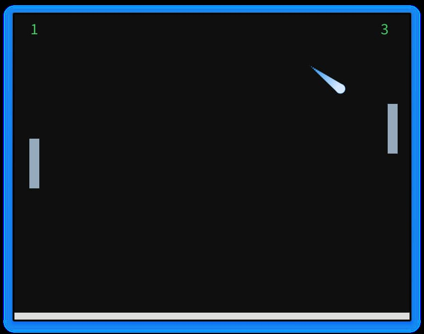

<div align = "center">

<h1><a href="https://2kabhishek.github.io/pojo-pong">Pojo Pong</a></h1>

<a href="https://github.com/2KAbhishek/pojo-pong/blob/main/LICENSE">
 </a>

<a href="https://github.com/2KAbhishek/pojo-pong/graphs/contributors">
 </a>

<a href="https://github.com/2KAbhishek/pojo-pong/stargazers">
</a>

<a href="https://github.com/2KAbhishek/pojo-pong/network/members">
 </a>

<a href="https://github.com/2KAbhishek/pojo-pong/watchers">
 </a>

<a href="https://github.com/2KAbhishek/pojo-pong/pulse">
 </a>

<h3>Pong with Pojos 🏓🕹️</h3>

<figure>
  
  <br/>
  <figcaption>pojo-pong screenshot</figcaption>
</figure>

</div>

## What is this

The classic Pong game, but recreated using `Processing` with the help of Pojos.

## Inspiration

Was trying out `Processing` and wanted to make a game using it.

## Prerequisites

Before you begin, ensure you have met the following requirements:

- You have installed the latest version of `Processing-Java`

## Getting pojo-pong

To install pojo-pong, follow these steps:

```bash
git clone https://github.com/2kabhishek/pojo-pong
cd pojo-pong
```

## Using pojo-pong

You can use the default `Processing` editor or use the `VS Code` plugin to run this.

## How it was built

pojo-pong was built using `Processing-Java`, `VS Code`.

## Challenges faced

Setting up `Processing` in `VS Code` was tricky.

## What I learned

- Learned about Processing and it's uses.
- Game loops and collision detection.

Hit the ⭐ button if you found this useful.

## More Info

<div align="center">

<a href="https://github.com/2KAbhishek/pojo-pong">Source</a> | <a href="https://2kabhishek.github.io/pojo-pong">Website</a>

</div>
